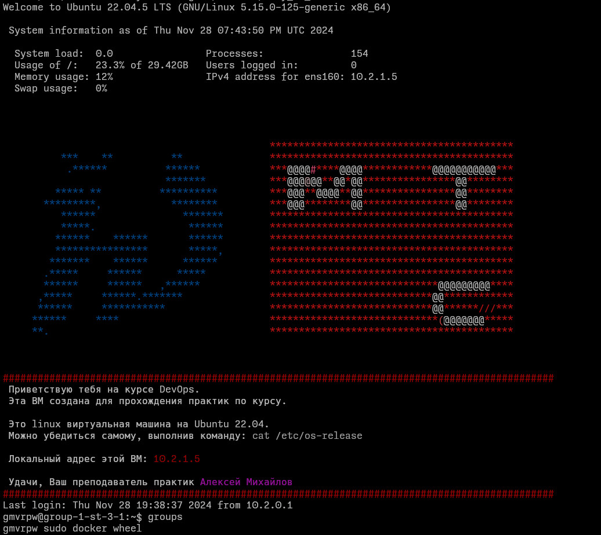
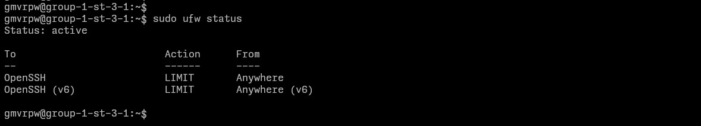

# Отчет о задании Ansible #1

## Используемые Ansible-модули:
1. `ansible.builtin.group`
2. `ansible.builtin.lineinfile`
3. `ansible.builtin.systemd_service`
4. `ansible.builtin.user`
5. `ansible.posix.authorized_key`
6. `community.general.sudoers`
7. `community.general.ufw`
8. `community.general.ufw`

## Проблемы
Отсутсвует модуль для конфигурации `/etc/ssh/sshd_config`, использован `ansible.builtin.lineinfile` с поиском
по регулярному выражению.

## Скриншоты
1. Новый пользователь `gmvrpw` и его группы (в том числе `wheel`)

2. Статус `ufw` из под `sudo` получен без введения пароля

