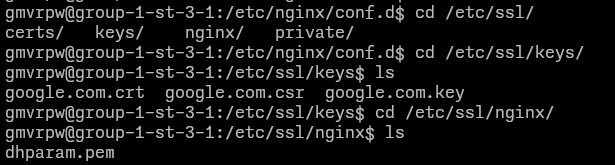

# Отчет о задании Ansible #2

## Оформление роли
Роль использует фаловую архитектуру придложенную `ansible-galaxy role init`:
1. Дефолтные переменныe расположены в `/defaults`
2. Хэндлеры расположены в `/handlers`
3. Задачи расположены в `/tasks`
4. Шаблоны расположены в `/templates`

## Поддерживаемые платформы
Роль поддерживает как Debian-base так и RHEL-base дистрибутивы, используя `apt` и `dnf` соответсвенно

## Используемые Ansible-модули:
1. `ansible.builtin.apt`
2. `ansible.builtin.copy`
3. `ansible.builtin.dnf`
4. `ansible.builtin.file`
5. `ansible.builtin.include_tasks`
6. `ansible.builtin.systemd_service`
7. `ansible.builtin.template`

## Скриншоты
1. Сертификаты вставленны в отсутсвующую ранее директорию 

2. Nginx конфиг сгенерирован из шаблона

3. Nginx корректно релодится

4. Сконфигурированный редирект на `google.com`: 

